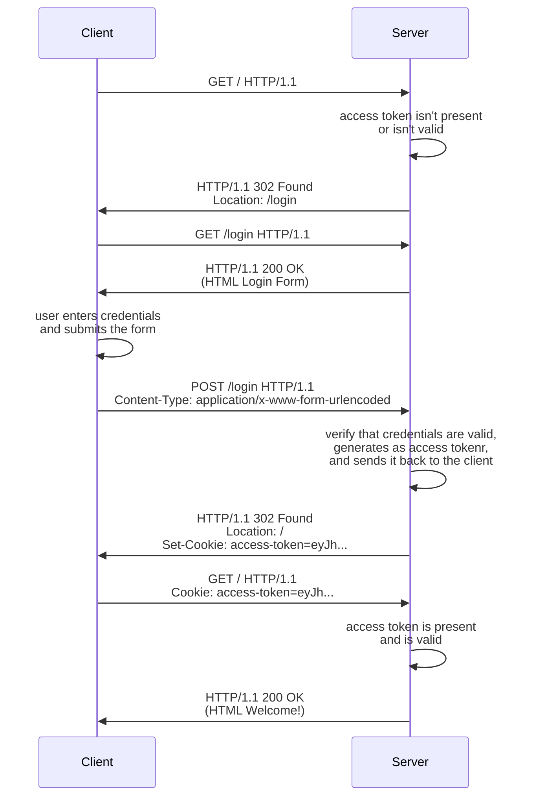

# Token Authentication[^1]

## How Does Token-Based Authentication Work?

Token-Based Authentication strategies refer to strategies that use access
tokens rather than server-side sessions. An access token is an object that
contains the identity of a user: a token can contain, for example, a username,
user's groups, and user's privileges.

Since the token already contains the user identity, and a signature that allows
the server to verify it's authenticity, we don't need to user server-side
sessions to keep track of which token is associated with which user in the
server.

A typical flow of an Token Based Authentication goes like this: The client
tries to access a restricted resource. The server checks if the request
includes an access token. (It can be in the header, in a cookie, or even in the
body, depending on the implementation.) If it does, it checks if the token is
authentic. If so, returns the resource. If not, the server redirects the client
to a login page. The user enters their credentials and sends a post request to
the appropriate URL. The server checks the credentials. If the credentials are
valid, it generates an access token, and sends it back to the client, and
redirects it to the original resource. If the credentials are invalid,
redirects to the login page.

Here's a sequence diagram for the typical flow:



A typical type of access token used for authentication is JSON Web Tokens
(JWT), but others are possible, like SAML.

A common problem about access tokens is where to store them in the client. One
options is to store them in the cookies. If this option is chosen, the
token may be susceptible to CRSF attacks, and strategies to mitigate this kind
of attacks would be necessary. Another option is to store them in `localStorage` 
or `sessionStorage`. If this option is chosen, the token may be susceptible to
XSS attacks, and strategies to mitigate this kind of attacks would be necessary

## How to Implement a Token Based Authentication?

The routes we need to handle a token based strategy is similar to the routes we
need for a session based strategy. The only difference is in how we verify the
validity of sessions and the tokens: with a session based strategy, we verify
if the session exists in the server; with a token based strategy, we verify the
validity of its signature.

We are going to use Fastify to illustrate these concepts. First, we add Fastify
to our project with `yarn add fastify`, and implement a basic server:

```javascript
import Fastify from "fastify";

const fastify = Fastify({
  logger: true,
});

const start = async () => {
  try {
    await fastify.listen({ port: 3000 });
  } catch (error) {
    fastify.log.error(error);
    process.exit(1);
  }
};

start();
```

We are going to need `jsonwebtoken` to handle the JWTs, `@fastify/cookies` to
handle cookies, and `@fastify/formbody` to process form submissions for the
login. (We also import `indexPage` and `loginPage`, which are just helper
functions to return the HTML for these pages.) After installing these packages,
we import them and register them with Fastify. We also define a `Map` with the
registered users and a secret to sign JWTs:

```javascript
import Fastify from "fastify";
import fastifyCookie from "@fastify/cookie";
import fastifyFormBody from "@fastify/formbody";
import jwt from "jsonwebtoken";
import { indexPage, loginPage } from "./html.js";

const fastify = Fastify({
  logger: true,
});

fastify.register(fastifyCookie);
fastify.register(fastifyFormBody);

const users = new Map([
  ["john", "1234567890"],
  ["jane", "0987654321"],
]);

const secret = "1234567890";

const start = async () => {
  try {
    await fastify.listen({ port: 3000 });
  } catch (error) {
    fastify.log.error(error);
    process.exit(1);
  }
};

start();
```

The next step is to define a protected `GET /` route. The logic is simple: we
check for the existence of the JWT; if it's there, check for it's validity; if
it's valid, show the resource; otherwise, redirect to the login page.

```javascript
fastify.get("/", async (request, reply) => {
  const accessToken = request.cookies.access_token;

  if (accessToken) {
    try {
      const username = jwt.verify(accessToken, secret).username;
      reply.type("text/html").send(indexPage(username));
    } catch (error) {
      reply.clearCookie("access_token");
      reply.redirect("/login");
    }
  }

  reply.redirect("/login");
});
```

Next, we define the unprotected `GET /login` route. The logic is again
straightforward: we check for the existence of the token; if it's there, and if
it's valid, redirect to `/`; otherwise, shows the login page:

```javascript
fastify.get("/login", async (request, reply) => {
  const access_token = request.cookies.access_token;

  if (access_token && jwt.verify(access_token, secret)) {
    reply.redirect("/");
  } else {
    reply.type("text/html").send(loginPage());
  }
});
```

Now we need a route to actually process the login and create the access token.
It checks for the username and password, and if it finds a match, creates a new
JWT token signed with the secret defined previously, send it to the client as a
cookie, and redirects them to `/`:

```javascript
fastify.post("/login", async (request, reply) => {
  const { username, password } = request.body;

  if (users.get(username) === password) {
    const token = jwt.sign({ username }, secret);

    reply.setCookie("access_token", token);
    reply.redirect("/");
  } else {
    reply.redirect("/login");
  }
});
```

Finally, a route for log out. It just clears the access token and redirects the
client to `/`.

```javascript
fastify.get("/logout", async (request, reply) => {
  const access_token = request.cookies.access_token;

  if (access_token) {
    reply.clearCookie("access_token");
  }

  reply.redirect("/");
});
```

And that's Token Based Authentication!

[^1]: **Disclaimer:** The code presented above and in the source files doesn't
  follow the security best practices that would be necessary in a real world
  application. The purpose of the code is to be as simple as possible, so the
  focus can be on the logic relevant to demonstrate the Token Based
  Authentication strategy.

